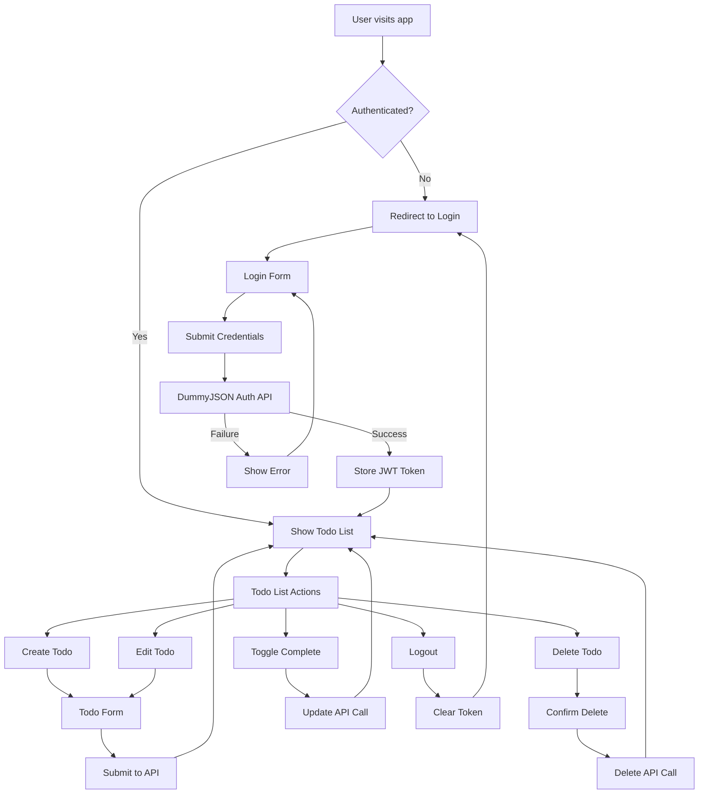

# Angular Todo App with Authentication

A modern, responsive todo application built with Angular v8, featuring JWT authentication and CRUD operations using the [DummyJSON API](https://dummyjson.com).

## 🚀 Features

- **JWT Authentication** - Secure login/logout with token management
- **Todo CRUD Operations** - Create, Read, Update, Delete todos
- **Responsive Design** - Works on desktop and mobile devices
- **Route Protection** - Protected routes with authentication guards
- **HTTP Interceptor** - Automatic token attachment and refresh
- **Modern UI** - Clean, intuitive user interface
- **Pagination** - Efficient handling of large todo lists
- **Error Handling** - Comprehensive error handling and user feedback

## 🛠️ Tech Stack

- **Frontend Framework**: Angular v8.2.14
- **Language**: TypeScript 3.5.3
- **Styling**: CSS3 with modern design patterns
- **HTTP Client**: Angular HttpClient
- **Forms**: Reactive Forms
- **Routing**: Angular Router with Guards
- **API**: [DummyJSON](https://dummyjson.com) for todos and authentication
- **Node.js**: Compatible with Node 14+ (tested with Node 22.x.x)
- **Package Manager**: npm 10.x.x

## 📁 Project Structure

```
src/
├── app/
│   ├── components/
│   │   ├── auth/
│   │   │   ├── login.component.ts
│   │   │   ├── login.component.html
│   │   │   └── login.component.css
│   │   └── todo/
│   │       ├── todo-list.component.ts
│   │       ├── todo-list.component.html
│   │       ├── todo-list.component.css
│   │       ├── todo-form.component.ts
│   │       ├── todo-form.component.html
│   │       └── todo-form.component.css
│   ├── services/
│   │   ├── auth.service.ts
│   │   └── todo.service.ts
│   ├── models/
│   │   ├── user.model.ts
│   │   └── todo.model.ts
│   ├── guards/
│   │   └── auth.guard.ts
│   ├── interceptors/
│   │   └── auth.interceptor.ts
│   ├── app-routing.module.ts
│   ├── app.module.ts
│   ├── app.component.ts
│   └── app.component.html
├── assets/
├── environments/
├── styles.css
└── index.html
```

## 🔄 Application Flow



## 🔐 Authentication Flow

The application uses JWT-based authentication with the following flow:

1. **Login**: User submits credentials to `/auth/login`
2. **Token Storage**: Access and refresh tokens stored in localStorage
3. **HTTP Interceptor**: Automatically attaches Bearer token to requests
4. **Token Refresh**: Automatic token refresh on 401 responses
5. **Route Protection**: Auth guard prevents access to protected routes
6. **Logout**: Clears tokens and redirects to login

## 📋 Todo Data Model

```typescript
interface Todo {
  id: number;
  todo: string;
  completed: boolean;
  userId?: number;
}
```

## 🚦 Getting Started

### Prerequisites

- Node.js 14+ (recommended: 14.21.3 for Angular v8 compatibility)
- npm 10.x.x

### Installation

1. **Clone the repository**

   ```bash
   git clone <repository-url>
   cd angular-todo-with-auth
   ```

2. **Install dependencies**

   ```bash
   npm install --legacy-peer-deps
   ```

3. **Start the development server**

   ```bash
   npm start
   ```

4. **Open your browser**
   Navigate to `http://localhost:4200`

### Demo Credentials

For testing purposes, you can use these sample credentials:

- **Username**: `emilys`
- **Password**: `emilyspass`

_Note: These are demo credentials from the DummyJSON API. You can find more users in the [DummyJSON users documentation](https://dummyjson.com/docs/users)._

## 🔧 Available Scripts

- `npm start` - Start development server
- `npm run build` - Build for production
- `npm run test` - Run unit tests
- `npm run lint` - Lint the code
- `npm run e2e` - Run end-to-end tests

## 🌐 API Endpoints

The application integrates with the following DummyJSON endpoints:

### Authentication

- `POST /auth/login` - User login
- `GET /auth/me` - Get current user
- `POST /auth/refresh` - Refresh access token

### Todos

- `GET /todos` - Get all todos (with pagination)
- `GET /todos/{id}` - Get single todo
- `GET /todos/user/{userId}` - Get todos by user
- `POST /todos/add` - Create new todo
- `PUT /todos/{id}` - Update todo
- `DELETE /todos/{id}` - Delete todo

## 🎨 UI Features

### Login Page

- Clean, modern login form
- Sample credentials helper
- Loading states and error handling
- Responsive design

### Todo List

- Paginated todo display
- Quick toggle completion status
- Search and filter capabilities
- Bulk actions support
- Responsive table design

### Todo Form

- Create and edit todos
- Form validation
- Character count indicator
- Rich text editing capabilities

## 🔒 Security Features

- **JWT Token Management** - Secure token storage and refresh
- **Route Guards** - Prevent unauthorized access
- **HTTP Interceptor** - Automatic token attachment
- **CSRF Protection** - Built-in Angular CSRF protection
- **XSS Prevention** - Angular's built-in sanitization

## 📱 Responsive Design

The application is fully responsive and works seamlessly across:

- Desktop computers (1200px+)
- Tablets (768px - 1199px)
- Mobile phones (320px - 767px)

## 🧪 Testing

### Running Tests

```bash
# Unit tests
npm run test

# E2E tests
npm run e2e

# Test coverage
npm run test -- --code-coverage
```

### Test Structure

- Unit tests for services and components
- Integration tests for user flows
- E2E tests for critical user journeys

## 🚀 Deployment

### Production Build

```bash
npm run build --prod
```

The build artifacts will be stored in the `dist/` directory.

### Environment Configuration

Configure different environments in `src/environments/`:

- `environment.ts` - Development
- `environment.prod.ts` - Production

## 🤝 Contributing

1. Fork the repository
2. Create a feature branch (`git checkout -b feature/amazing-feature`)
3. Commit your changes (`git commit -m 'Add some amazing feature'`)
4. Push to the branch (`git push origin feature/amazing-feature`)
5. Open a Pull Request

## 📝 License

This project is licensed under the MIT License - see the [LICENSE](LICENSE) file for details.

## 🙏 Acknowledgments

- [DummyJSON](https://dummyjson.com) for providing the free API
- [Angular Team](https://angular.io) for the amazing framework
- [Angular Material](https://material.angular.io) for design inspiration

## 📞 Support

If you have any questions or need help, please:

1. Check the [Issues](../../issues) page
2. Create a new issue if your problem isn't already reported
3. Provide detailed information about your environment and the issue

---

**Happy Coding! 🎉**
